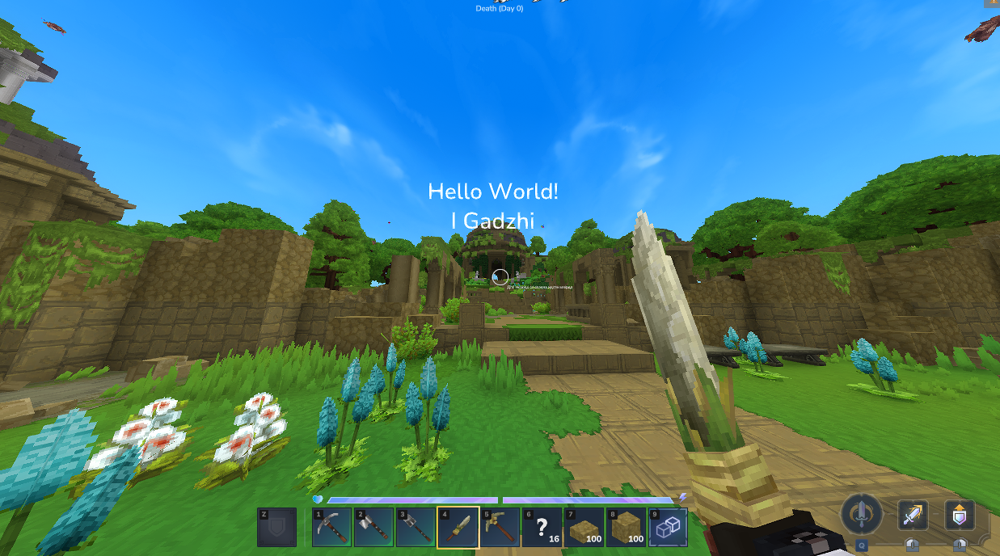

# HologramsPlugin 
This plugin provides a hologram system for Hytale servers, allowing administrators to create, manage, and remove floating text holograms directly in the game world. Holograms are displayed as floating text and can be used to show informational messages, server rules, hints, or navigation elements. 

All management is done through simple server commands:

Creates a new text hologram
```bash
/hologram create <text> — 
/hologram create 'Hello World#I Gadzhi' - for multiline
```

Removes a hologram by its ID
```bash
/hologram remove <id>
```

Displays a list of all existing holograms
```bash
/hologram list
```

Permissions for managing commands
```bash
holograms.management
```

⚠️ Hytale server does not remove holograms automatically.
If you plan to uninstall the plugin, make sure to remove all holograms using the command beforehand; otherwise, they will remain in the world.


